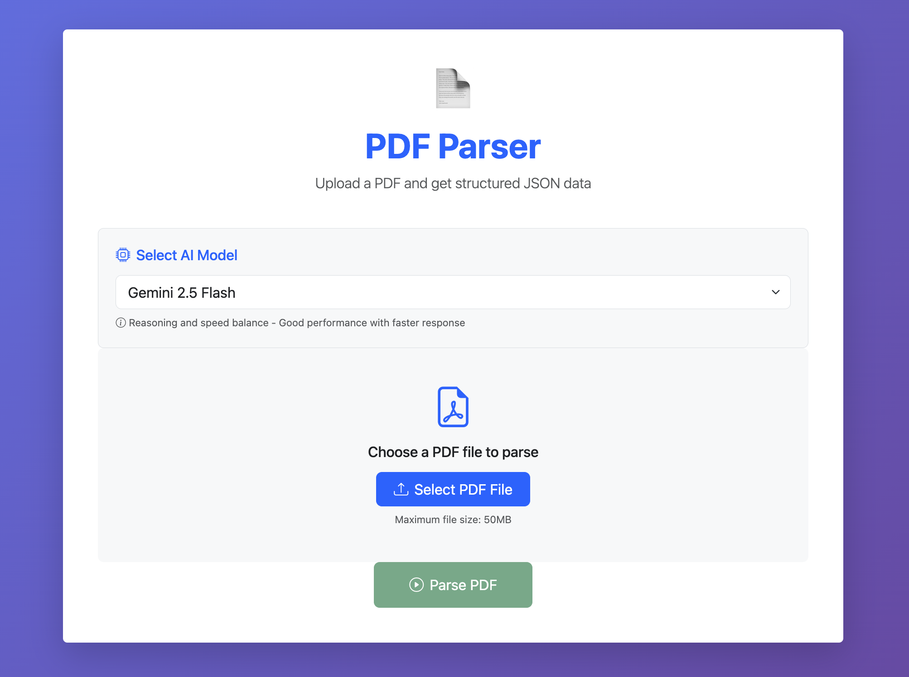
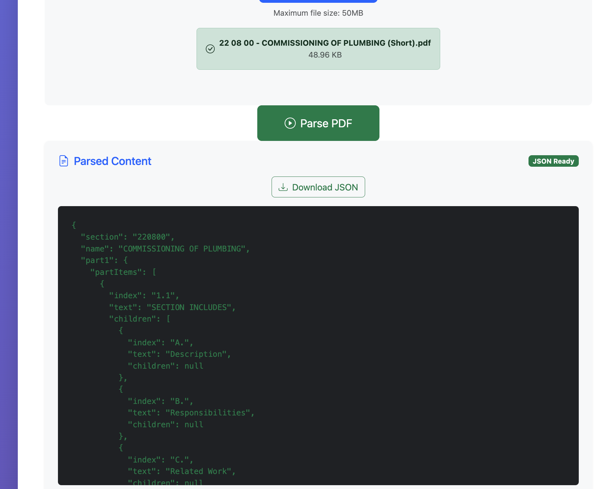

# 📄 PDF Parser

A full-stack app to extract structured JSON from construction spec PDFs using Gemini models.

---

## ⚙️ Prerequisites

- Python 3.9+
- Node.js 18+
- Gemini API Key

---

## 🔧 Setup

### Backend

```bash
# Navigate to backend directory
cd backend

# Create virtual environment
python -m venv venv

# Activate virtual environment (macOS/Linux)
source venv/bin/activate

# Activate virtual environment (Windows)
# venv\Scripts\activate

# Install Python dependencies
pip install -r requirements.txt

# Create environment file with your API key
echo GEMINI_API_KEY=your_api_key_here > .env

# ✅ Verify your .env file
cat .env
# You should see:
# GEMINI_API_KEY=your_api_key_here, NOT JUST your_api_key_here


# Start backend server with auto-reload
uvicorn main:app --reload
```

### Frontend

#### Start a new terminal before running the following commands

```bash
# Navigate to frontend directory
cd frontend

# Install Node.js dependencies
npm install

# Start development server
npm run dev
```

---

## 🚀 Run

- Backend: http://localhost:8000
- Frontend: http://localhost:3000

Upload a PDF, select a model, and view structured JSON.

### ⚡ Model Selection Recommendation

**⚠️ Important:** Gemini 2.5 Pro is too slow for longer texts. **We recommend using Gemini 2.5 Flash** for better performance and faster processing times, especially for larger PDF files.

- **Gemini 2.5 Flash** (Recommended): Fast processing with good accuracy
- **Gemini 2.5 Pro**: Highest accuracy but could be slow for long documents
- **Gemini 2.0 Flash Lite**: Cost-effective for simple documents

---

## 📁 Results

**Parsed PDF outputs are stored in:** `documents/results/`

The following JSON files contain the structured extraction results from the 4 test PDFs:

```
documents/results/
├── 22 08 00 - COMMISSIONING OF PLUMBING (Short).json
├── 23 82 43 Electric Heaters.json
├── 233000 HVAC Air Distribution (Long).json
└── 271500 (Medium).json
```

---

## 🎨 UI Reference

The frontend provides a modern interface with:

- **Model Selection**: Dropdown to choose between Gemini 2.5 Pro, 2.5 Flash, or 2.0 Flash Lite
- **File Upload**: Drag-and-drop or click-to-select PDF files (max 50MB)
- **Real-time Processing**: Loading states and progress indicators
- **JSON Viewer**: Syntax-highlighted display of parsed content
- **Download**: Export parsed JSON files
- **Error Handling**: User-friendly error messages and validation

### What You Should See

**Main Interface:**


**Sample Output:**


The interface should show a clean, modern design with model selection, file upload area, and structured JSON output display.

---

## 🐛 Troubleshooting

- Check `.env` for API key
- Backend must run before frontend
- PDFs must be under 50MB
